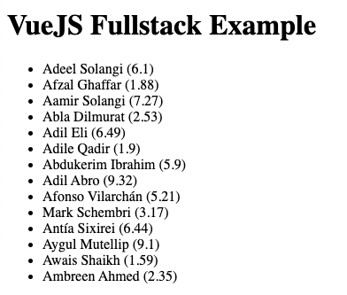

# Coding Challenge

## About

In this repo you will find a full stack coding challenge. 
The goal is to implement a dockerized VueJS application that fetches data from a Python Flask backend and displays it in a list.

## Some pointers

- The data that the backend should return can be found in `src/backend/data.json`. Load this json in the api.py file.
- The frontend should display the data in a list. Each item in the list should display the `name` of the person.
- The frontend has a dependency already defined that helps with data fetching.
- The frontend dev-server is configured to proxy /api to the Flask backend to avoid CORS.
- Use the provided Dockerfile to build the image.
- Run the image and expose the frontend server (find out which port this uses) to your machine.

## Example output

